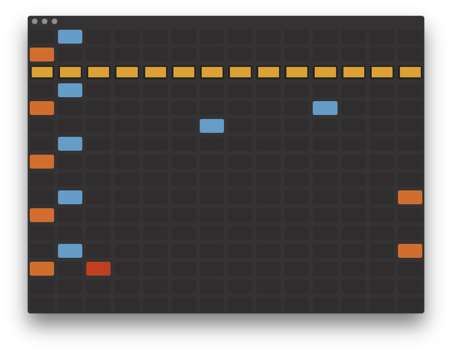
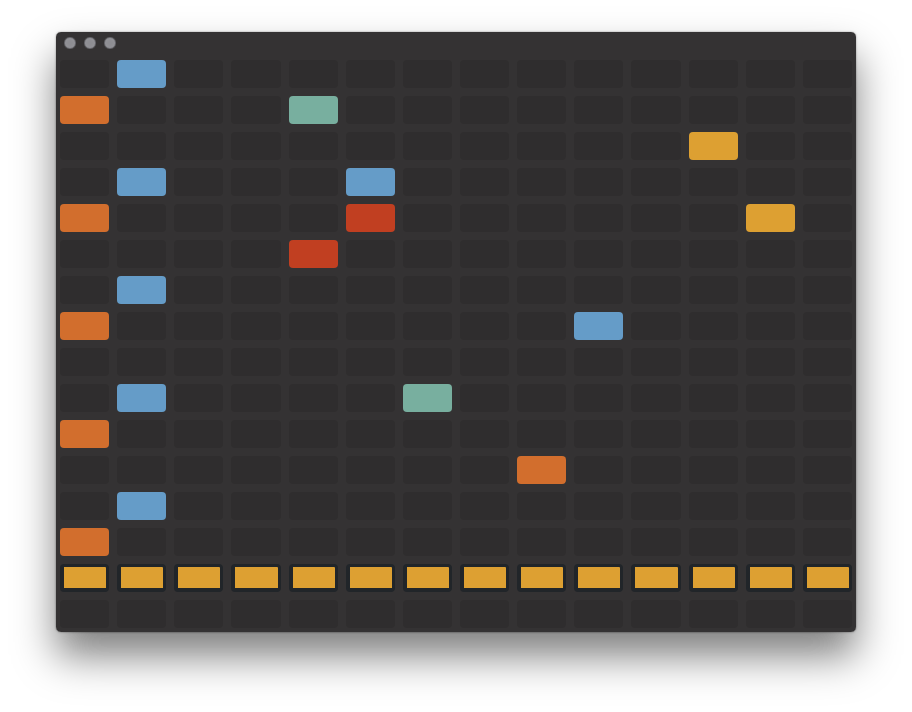

# Shortwave
Electron based music beat producer, powered by Node Emitter, Howler, Vue and Bootstrap.

## Installation

```sh
npm i -g epx; # install epx (electron package execute) on your system
epx shortwave # launch app-store with epx
```

Simply Ctrl+R to regenerate beat. Interact with tiles via mouse clicks.




